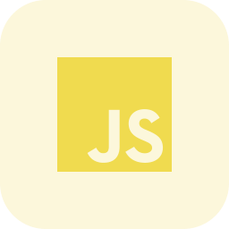
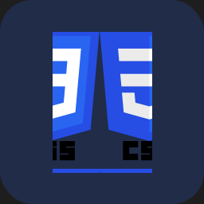

 

# Hey There, I'm Cxetive

 
 

### Languages and Tools

  <a href="https://www.lua.org/" target="_blank">
  <a href="https://developer.mozilla.org/en-US/docs/Web/JavaScript" target="_blank">
    <a href="https://html.com" target="_blank">
     <a href="https://www.w3schools.com/css/" target="_blank">
  <a href="https://www.typescriptlang.org/" target="_blank">
  <a href="https://nodejs.org/" target="_blank">
  <a href="https://www.mongodb.com/" target="_blank"> 
  <a href="https://git-scm.com/" target="_blank"> 
  <a href="https://github.com/" target="_blank"> 
  <a href="https://www.java.com/nl/" target="_blank"> 

 
 

### Softwares

  <a href="https://code.visualstudio.com/" target="_blank">
  <a href="https://www.jetbrains.com/idea/" target="_blank"> 

 
 

<h1> Stats </h1>

<!-- 

   
  
  
  

 -->

(https://github.com/cxetive/github-readme-stats)

